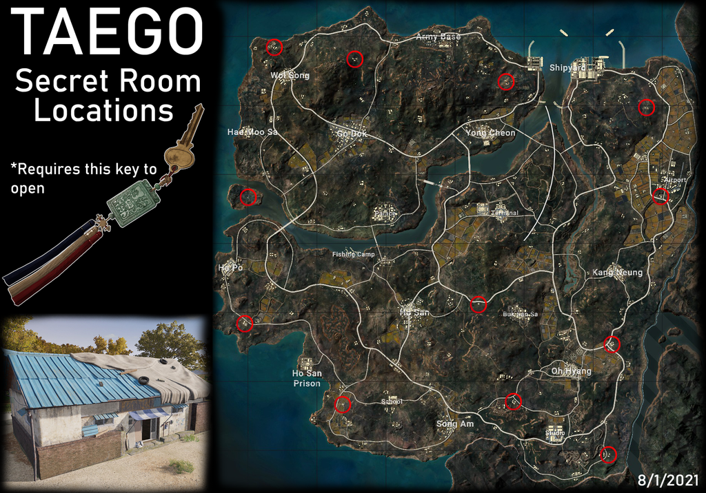
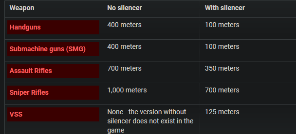
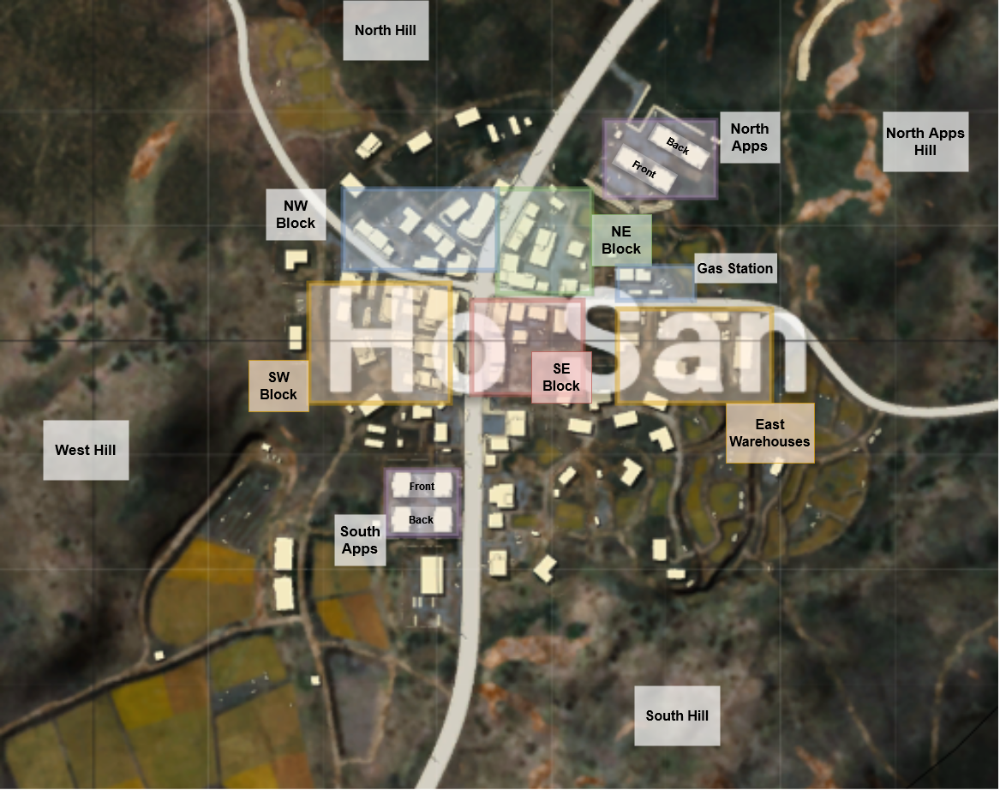

---
# Feel free to add content and custom Front Matter to this file.
# To modify the layout, see https://jekyllrb.com/docs/themes/#overriding-theme-defaults

layout: home
---

# Contents

- [Useful links](#useful-links)
- [Useful images](#useful-images)
- [Starter guides](#starter-video-guides)
- [Weapons and attachments](#weapons-and-attachments)
- [Random tips](#random-tips)
- [Settings](#settings)
- [Strategy](#strategy)
- [Movement](#movement)
- [Sounds](#sounds)

# Useful links

- [Weapon damage stats](https://docs.google.com/spreadsheets/d/e/2PACX-1vRDwzocMt51C2mseKX01ZubfMctjmOeFQ8WS8ZzibSpH6ZWCo3BXXuCyW_ROxV1IiqUzpmwTa_PGNFZ/pubhtml)
- [PUBG Reddit](https://old.reddit.com/r/PUBATTLEGROUNDS/)
- PUBG Esports
	- [Site](https://www.pubgesports.com/en/main) 
	- [Twitch](https://www.twitch.tv/pubg_battlegrounds) 
	- [Youtube](https://www.youtube.com/c/PUBGEsports/videos) 
- [PUBG Patch notes and announcements](https://store.steampowered.com/news/app/578080)
- [Interactive maps](https://pubgmap.io/)
	- Site is outdated and missing maps, but you can see where vehicles spawn, how much loot spawns, etc.

# Useful images
Taego Secret Room locations

How far can you hear certain guns?

Ho San callouts because we drop there a lot

Taego building calloutso

# Starter guides

- [How to get better at PUBG fast](https://www.youtube.com/watch?v=1fXNgu1zw3M) - Wackyjacky101
- [How far away can you hear sounds?](https://www.youtube.com/watch?v=ukh3xQ7J7lI) - Wackyjacky101
	- **Note this video is from 2018 and could be outdated**
	- Very important for understanding what you hear!
- [Early Game Strategy](https://www.youtube.com/watch?v=naSipDEcgcE) - Wackyjacky101

[_back to contents_](#contents)

# Weapons and attachments

- [Attachments and guns](https://www.youtube.com/watch?v=U8AcQ2JOZx0) - Pistolatime
- [Competitive weapon choice](https://www.youtube.com/watch?v=py3Uw_3lLfk) - Pistolatime
- [Recoil control](https://www.youtube.com/watch?v=8_-EL7HM8xY) - Pistolatime
- [K9 vs M24](https://www.youtube.com/watch?v=9AwBCedrftY) - Wackyjacky101
- [Beryl](https://www.youtube.com/watch?v=ITBzDtIBs-A) - Wackyjacky101
- [Decoy grenades](https://www.youtube.com/watch?v=n8e_F9bmk5E) - Wackyjacky101
- [Grenade throwing](https://www.youtube.com/watch?v=Mn3uR4bzfSk) - Wackyjacky101
- [Bolt action guide](https://www.youtube.com/watch?v=PUXcUvXYdAI) - Wackyjacky101
- [Red dot vs Holographic](https://www.youtube.com/watch?v=8bjOBKsF05A) - Wackyjacky101
	- Red dot
- [DBS guide](https://www.youtube.com/watch?v=p6XkhbQkJE4) - Wackyjacky101
- [SKS guide](https://www.youtube.com/watch?v=T19vLq2KrcA) - Wackyjacky101
- [Vector guide](https://www.youtube.com/watch?v=kVbThDI5s0o) - Wackyjacky101
- [M4 guide](https://www.youtube.com/watch?v=kGZX_GqXXco) - Wackyjacky101
- [Mini guide](https://www.youtube.com/watch?v=TJthlYChwm0) - Wackyjacky101
- [UMP45 guide](https://www.youtube.com/watch?v=FGMR5cpNM90) - Wackyjacky101
- [Grip analysis](https://www.youtube.com/watch?v=2Bpvz22MK24) - Wackyjacky101
- [QBU guide](https://www.youtube.com/watch?v=-TuA_NPkLmE) - Wackyjacky101
- [QBZ guide](https://www.youtube.com/watch?v=DUZCid87Rto) - Wackyjacky101

[_back to contents_](#contents)

# Random tips

- [Still more tips](https://www.youtube.com/watch?v=9O1wGQ7qfkM) - Wackyjacky101
	- Window jumping
	- Drive-bys
	- Weapon swapping in vehicles
	- Canted zoom speed
	- Right peeks vs left peeks
- [Even more tips](https://www.youtube.com/watch?v=t7Ant7EOF88) - Wackyjacky101
	- Silent drive-bys
	- VPNs
	- Reticle color changing
	- Crosshair sprinting
	- Canted zoom speed
	- Delete game videos
	- Weapon swapping in vehicles
- [More tips](https://www.youtube.com/watch?v=W8aLDVu29c4) - Wackyjacky101
	- Canted sight ADS zoom speed
	- Crouch before proning with drop shots
	- Fast weapon draw
	- One breath river cross (Sanhok)
	- Sticky bomb doors
- [Tips 1](https://www.youtube.com/watch?v=VC0CLAqOt9c) - Wackyjacky101
	- Not getting hit by cars
	- Grenade baiting
	- Grass doesn't render from far away
	- Door jumps *(largely outdated)*
	- Water strategy *(do not do this, this is outdated, you can't swim as long as you could before)*

[_back to contents_](#contents)

# Settings

- [Effects setting explainer](https://www.youtube.com/watch?v=w7UxwxuM_dM) - Wackyjacky101
	- Set effects to ultra
- [Must-have keybinds](https://www.youtube.com/watch?v=WIzsflbGy0A) - Wackyjacky101
- [FOV Settings](https://www.youtube.com/watch?v=jgcRjALeuO0) - Wackyjacky101
 - [Monitors](https://www.youtube.com/watch?v=pxIQX46zNFs) - Wackyjacky101

[_back to contents_](#contents)

# Strategy

- [Baiting enemies](https://www.youtube.com/watch?v=8If2xZyY3ks) - Wackyjacky101
	- Fake fighting
 - [Aiming guide](https://www.youtube.com/watch?v=SbauFhd96dE) - Wackyjacky101
 - [Recoil control](https://www.youtube.com/watch?v=j5slpa-BySQ) - Wackyjacky101
- [Shooting uphill or downhill](https://www.youtube.com/watch?v=JG1JR3rYCIo) - Wackyjacky101
- [Late game guide](https://www.youtube.com/watch?v=pS5HYRF5PH8) - Wackyjacky101
- [Pushing buildings](https://www.youtube.com/watch?v=rXZT7TqZpj0) - Wackyjacky101
-  [Gun fighting tips](https://www.youtube.com/watch?v=mBF_VoKMXN8) - wtfmoses
- [GLL VOD Review](https://www.youtube.com/watch?v=IQdkFvQh_oM) - Pistolatime
- [Aim Training](https://www.youtube.com/watch?v=-7fcR1lDR1I) - Pistolatime
- [Early Game Strategy](https://www.youtube.com/watch?v=naSipDEcgcE) - Wackyjacky101

[_back to contents_](#contents)

# Movement

- [Movement](https://www.youtube.com/watch?v=YD8KlWUIRAU) - Pistolatime
- [Advanced movement](https://www.youtube.com/watch?v=EHVKLke-ap0) - Wackyjacky101
 - [Avoid getting shot while running](https://www.youtube.com/watch?v=YAhzQxJhjnY) - Wackyjacky101
- [Window jumping](https://www.youtube.com/watch?v=RiDOfgVz3N4) - Wackyjacky101
- [Advanced car mechanics](https://www.youtube.com/watch?v=yUoPTolyDbk) - Pistolatime

[_back to contents_](#contents)

# Sounds

- [Sound lock to protect your ears](https://www.youtube.com/watch?v=IGf7Jl2T7dY) - Wackyjacky101
- [Placing incoming shots](https://www.youtube.com/watch?v=zBSBu72qF0s) - Wackyjacky101
- [Gunshot distance sound](https://www.youtube.com/watch?v=ToSjxK7Y0UU) - Wackyjacky101
- [How far away can you hear sounds?](https://www.youtube.com/watch?v=ukh3xQ7J7lI) - Wackyjacky101
	- **Note this video is from 2018 and could be outdated**
	- Very important for understanding what you hear!

[_back to contents_](#contents)
